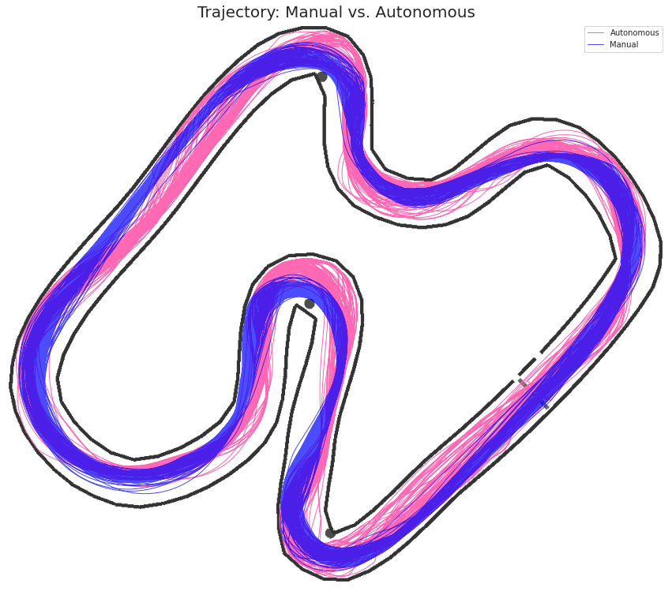
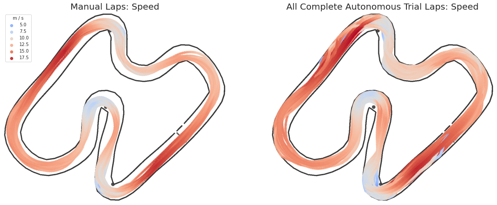
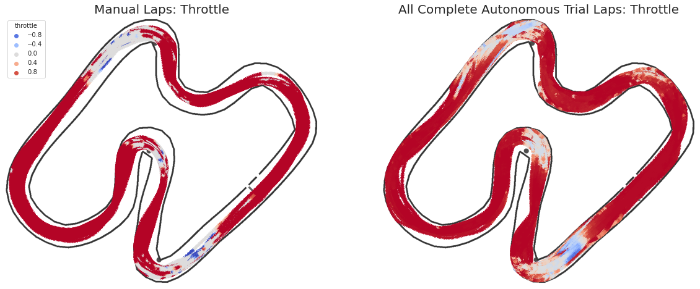
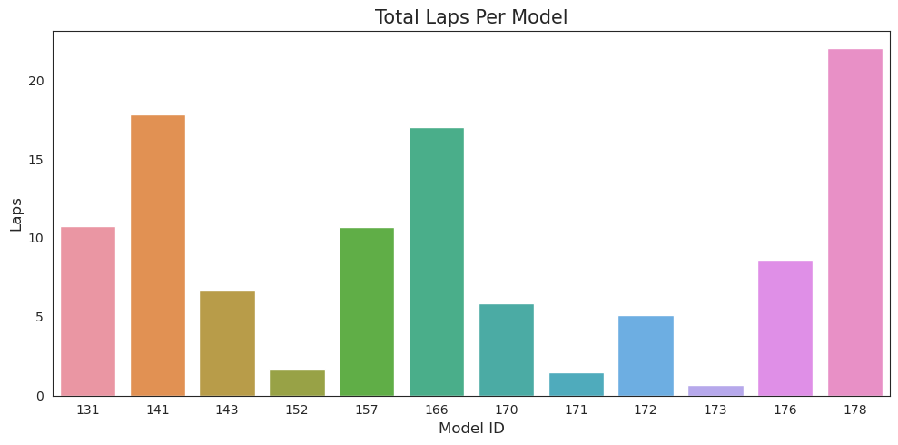
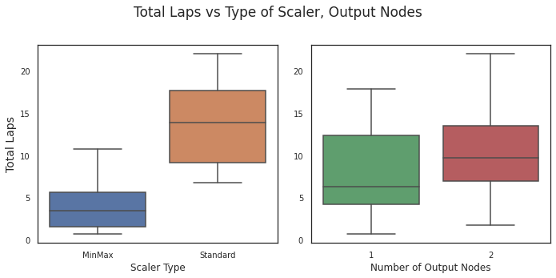
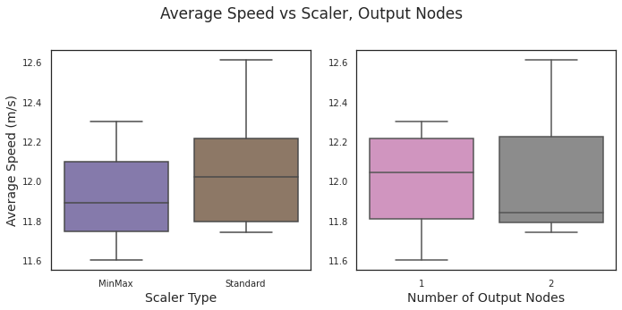
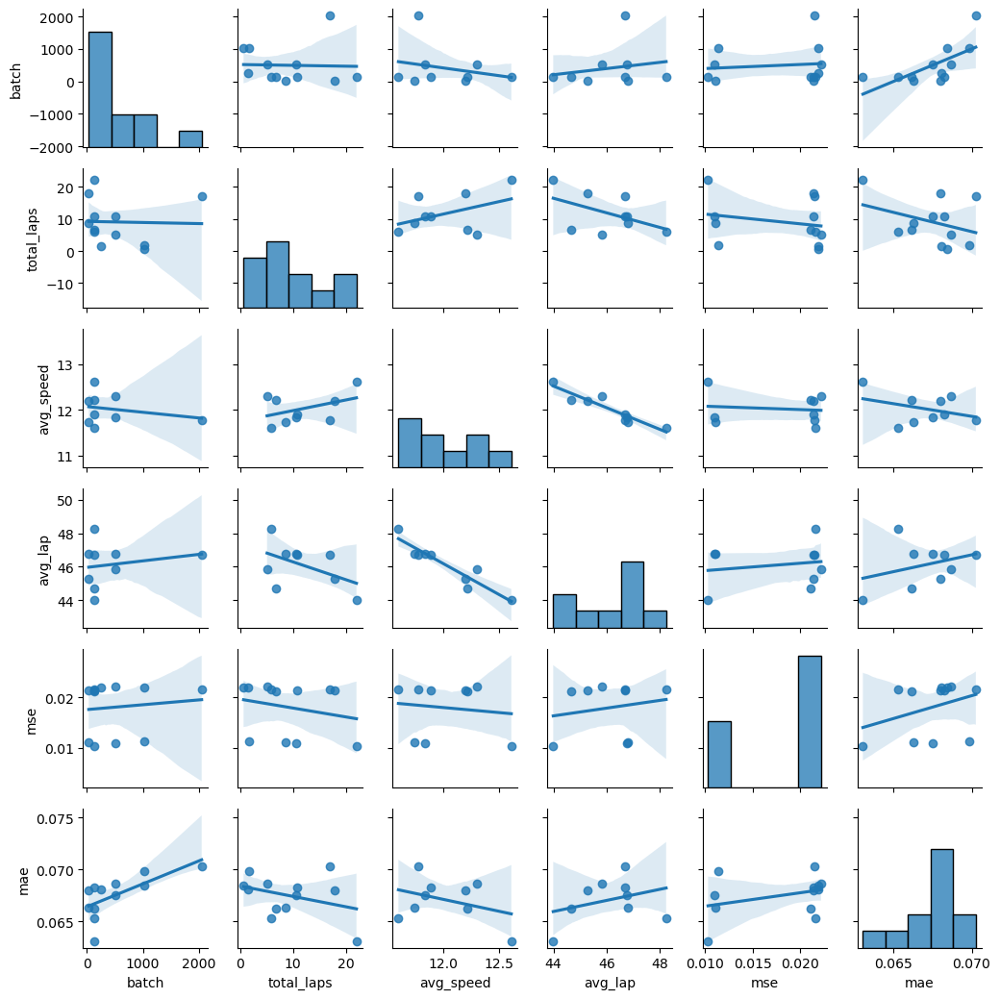

# Neural-Net Racer Project
General Assembly Data Science Immersive capstone

## Abstract
In this project I attempted to train a neural network how to drive a race car around a simulated track. I used Keras to construct several neural network models, fit those models to manually-recorded telemetry data, then used said models to predict appropriate steering and throttle inputs based on real-time telemetry data. After my initial models’ performance plateaued at a suboptimal level, I adopted the basic structure of a pre-existing neural network model to establish a “competent” baseline performance. After considerable experimentation, I was able to get somewhat consistent performance out of slightly altered versions of that model. Nine models were able to complete more than one consecutive lap without crashing, though the limitations of my chosen test environment meant that they did so in a way that would not map well to real race cars. Thus, I intend to reframe my objectives, switch tracks, and continue the process.

<!--- 
    Sources:
    https://github.com/Toemass-Moon/Gesture-Control/blob/main/README.md
    https://towardsdatascience.com/how-to-write-a-scientific-paper-from-a-data-science-project-62d7101c9057 
    https://www.abhith.net/blog/markdown-link-within-document/ 

-->
## Table of Contents
<!-- 1. [Abstract](#abstract) <!-- Does this even belong on the table? It should probably go before...-->
1. [Acknowledgements](#acknowledgements)
1. [Introduction](#intro)
1. [Related Work](#related)
1. [Methodology](#methods)
1. [Experiments](#experiments)
1. [Results](#results)
1. [Discussion](#discussion)
1. [Conclusion](#conclusion)
1. [References](#sources)

## Acknowledgements <!--- [^](#toc) -->

* GA Crew (Joseph Hicks, Noah Christiensen, Patrick Wales-Dinian) -  vital project feedback and guidance 
* Tawn Kramer - creating the Donkey Gym environment
* Maxime Ellerbach et al. - maintaining and expanding Donkey Gym
* Braden Andersen - autonomous driving capstone experience/advice
* Thomaz Moon - shared example of what a good project looks like

## Introduction <!--- [^](#toc) -->

Autonomous automotive racing competitions range from amateurs and students with modified radio control cars[[1]](#n_1)[[2]](#n_2) to university teams with mid-to-full scale race cars[[3]](#n_3)[[4]](#n_4) to massively sponsored government and commercial competitions.[[5]](#n_5) The DARPA Grand Challenge[[6]](#n_6) ignited my interest in autonomous racing, and the desire to learn the inner workings of autonomy is part of what motivated me to enroll in the data science immersive course in the first place.

For this project's hypothetical framework, I have cast myself as a member of a nascent self-driving race team. I have given myself the task of leveraging my machine learning experience to lay the groundwork for my team's autonomous control software.

## Related Work  <!--- [^](#toc) -->
An extensive summary of previous work in autonomous driving, which stretches back nearly a century,[[7]](#n_7) will not be attempted here. Instead, I will cover the most relevant single source, Donkey Car.[[8]](#n_8)

The Donkey Car project served as a direct inspiration for my capstone. Donkey Car is an open-source software and hardware framework designed to lower the material costs and programming efforts required to experiment with autonomous driving. It provides software in the form of highly modular and extensible Python libraries, including integrated Keras neural network models. I was aware of the machine learning components of the project, and I had constructed my own Donkey Car, but I had not yet delved deeply into the code.

  
 *fig x*: Left: a Donkey Car. Right: the author's Donkey Car.

Figure x: Left: 

## Methodology  <!--- [^](#toc) -->

  
 *fig x*: Demo lap. Left: overhead map. Right: chase view.

A data was collected by manually driving a race car around a simulated track while recording video and telemetry output. Training and test sets were built from this data, which were then scaled with either a min-max scaler or a standard scaler, and used to train a neural network. The neural network used two inputs. Images were fed into several convolutional neural network (CNN) layers, then flattened. In parallel to the image CNN layers, telemetry data was input into several basic feed-forward dense layers. The output of the flattened image and telemetry data layers was then concatenated and sent through a few more dense layers, and output either in a single two-unit linear-activation dense layer, or in two parallel single-unit linear-activation dense layers.

After fitting, each model was saved, as was the scaler used on the data. Both were then plugged back into the simulator client. As image and telemetry data was retrieved from the simulation server, it was converted and scaled into the same format with which the model had been trained, and used by the model to make a single prediction. The resulting steering and throttle predictions were sent back to the race server as control inputs.

Many models were tried, each with different hyperparameters (including number of layers). Each model was given one or two pre-trials to determine if it was capable of completing a circuit of the track. Models that were able to complete more than one consecutive laps were deemed successful. Successful models were then each given five trial runs. Full telemetry data was recorded for each trial, and said data was used to evaluate model performance.

## Experiments  <!--- [^](#toc) -->
### Data Description
Three candidate datasets were collected, each with a different simulated camera resolution. The default 120x160 pixel image format was tried, but proved to be too computationally intensive for my computer. Several laps were then tried with 32x32 images, but the models produced with this data were not capable of the performance I desired. I settled on a 64x64 format and proceeded to drive for 150 laps. This process took over two hours, and resulted in 125,400 records. I pruned data based on the time taken to drive each lap; cutting laps that took more than 43 seconds nicely eliminated all outliers, and it resulted in a set of 115,052 records. 

figure: pre-cut, post-cut

### Metrics
Mean squared error was used as the loss function with which to fit the models. Mean average error and root mean squared error were also collected for purposes of comparison.

Track performance was measured in number of laps completed, along with best and mean lap times, over the course of the five trial runs.

### Adopted Technology

figure: donkey gym screen. map gif?

All data collection and trials took place in the Donkey Gym simulated environment,[[9]](#n_9) which is a wrapper for the OpenAI Gym environment.[[10]](#n_10) A custom Python program was written to send commands to a locally-hosted Donkey Gym server, and to receive and record images and telemetry from the same.

Data preparation and modeling took place in a collection of Jupyter notebooks, primarily using Pandas, scikit-learn and Keras Python libraries.

## Results  <!--- [^](#toc) -->

190 models were constructed and pre-trialed. Models were given multiple pre-trials if they failed to complete a lap but demonstrated the potential to do so.

32 models completed at least one lap.

12 models were able to complete two or more sequential laps, and moved on to fully-recorded trials. 

3 models failed to complete even a single lap over the course of their five trials.

Each of the remaining 9 models completed at least one lap in at least two of five trials, and each completed more than one lap at least once. The average number of laps completed by the 9 successful models over all five trials is ~1.96. The average trial laps for all 12 models is ~1.67.

### Track Performance
  
 *fig x*: Due to the excessive throttle applied by autonomous driving models, cars were carried further both into and out of turns, resulting in trajectories that drifted closer to the track's inside walls. The cars were not able to negotiate turns at the shallow approach angles that resulted from this.

  
 *fig x*: In general, models carried more speed into each corner, which, coupled with shallower lines, resulted in overshooting turns and colliding with walls.

  
 *fig x*: Some of the models attempted to brake, but did not do so early enough to overcome poor trajectories and excessive speed.  

### Model Metrics

|ID|Batch Size|Output Nodes|Scaler|Telmetry|Total Laps1|Avg Lap Time2|Avg Speed3|MSE|MAE|
|:---|:---|:---|:---|:---|:---|:---|:---|:---|:---|
| **131** |128|1|MinMax|activeNode, pitch, roll, speed, yaw|10.735|46.71|11.89|0.02143|0.06828
| **141** |32|1|Standard|activeNode, pitch, pos_x, pos_z, roll, speed, yaw|17.846|45.30|12.20|0.02141|0.06800|
| **143** |128|1|Standard|activeNode, pitch, pos_x, pos_z, roll, speed, yaw|6.717|44.67|12.22|0.02115|0.06618|
| **152** |1024|2|MinMax|activeNode, pitch, pos_x, pos_z, roll, speed, yaw|1.704|-|-|0.01135|0.06982|
| **157** |512|2|Standard|activeNode, pitch, pos_x, pos_z, roll, speed, yaw|10.675|46.78|11.84|0.01095|0.06749|
| **166** |2048|1|Standard|pos_x, pos_z, speed, yaw|17.039|46.70|11.78|0.02157|0.07027|
| **170** |128|1|MinMax|pos_x, pos_z, speed, yaw|5.846|48.25|11.60|0.02163|0.06532|
| **171** |256|1|MinMax|pos_x, pos_z, speed, yaw|1.479|-|-|0.02191|0.06806|
| **172** |512|1|MinMax|pos_x, pos_z, speed, yaw|5.105|45.83|12.30|0.02222|0.06865|
| **173** |1024|1|MinMax|pos_x, pos_z, speed, yaw|0.674|-|-|0.02190|0.06844|
| **176** |32|2|Standard|pos_x, pos_z, speed, yaw|8.644|46.79|11.74|0.01103|0.06631|
| **178** |128|2|Standard|pos_x, pos_z, speed, yaw|22.004|43.99|12.61|0.01030|0.06306|  

1. Includes incomplete laps  
2. Seconds, complete laps only  
3. Meters per second, complete laps only  

  
 *fig x*: This plot demonstrates the disparity in models' performance
    
  
 *fig x*: Standard Scaler appears to result in models that are capable of driving further, but output configuration does not seem to make a significant difference.

  
 *fig x*: Neither scaler type nor output configuration appears to play much of a role in average speed.

I had hoped to compare the Keras model metrics to on-track performance, but the relative lack of data made that impossible; there simply wasn't enough information to draw conclusions. The following pairwise plot illustrates the sparsity.  

  
 *fig x*: Pairwise plot of metrics and performance measures  

No model performed at the level required for real-world racing safety. With one exception, every lap driven by even the most successful models included at least one instance of high-speed contact with a wall. This would not be acceptable for a real car on an actual, physical track.

## Discussion  <!--- [^](#toc) -->

Behaviors emerge from an intelligent agent's interaction with its environment. In this case, the overspeeding and crash-happy driving demonstrated by my models resulted from my choice of track and simulator.

Donkey Gym offers a choice of seven different race tracks. Six of these tracks are faithful recreations of the real-world settings in which Donkey Car competitions are held. They simulate a 1/16th radio controlled car in a full-scale space. The seventh track is a 1/16th scale approximation of a full scale race track. There are massive differences between a 1/16th scale vehicle in full scale space and a full scale vehicle in 1/16 scale space. Donkey Gym was designed and tuned for the former, but the real-world hypothetical framing of my project required the latter. In short, I chose the wrong simulator for my task.

The simulated Donkey Car's stopping and turning abilities approximate those of the real 1/16 scale version. It has a high center of gravity thanks to all of the heavy electronics bolted to the top of its monster truck frame. On a 1/16th scale race track it drives less like a race car and more like an overloaded double-decker bus. The track is dominated by two long straightaways and wide turns. Most of the training data was collected at full throttle, and all models seemed to use full throttle as their default setting. The models were not sophisticated enough to recognize when and how much they needed to slow down. On a long, narrow track with sharp turns and roadside barriers, collisions were inevitable. The only model that never collided with a wall only avoided doing so by stopping immediately after crossing the starting line.

Collisions had six possible outcomes:
* Flipping onto back or side. This was a common result for high speed collisions.
* Getting stuck face-first against a wall. Reversing away from obstacles only occurred in the slowest manually-driven laps, and those laps had been cut from the training data, so models had no way to extricate themselves from such a state.
* Sticking on wall or cone geometry in some other way. This is an artifact of the simulated environment's collision detection and handling.
* Driving the wrong direction after getting flipped around. Models could not distinguish lap direction, so they drove the course as if they were facing the right way.
* Glancing off the wall at a proper angle and speed to remain unstuck and facing the right direction
* Hitting the wall hard enough to bounce clear and avoid getting stuck.

All successful models responded to impending collisions by angling themselves to bounce off walls instead of sticking to them. Several successful models employed what could be called strategic crashing; they scrubbed speed before challenging turns by either scraping along or bouncing off of the preceding walls. The strategy works only because the simulator doesn't account for collision damage; it isn't a factor in the races being simulated.

If I wished to stay true to the full-scale race team scenario, I should have chosen a different simulator. If I wanted to use the Donkey Gym simulator, I could have reframed the project. As it was, time constraints made either course of action impossible.

## Conclusion  <!--- [^](#toc) -->

The project had some negatives. By the time I recognized the error of some of my foundational choices, there wasn't enough time to start over. I also resorted to using a preexisting model, which is something I had hoped to avoid, and I ran out of time to switch back to my own. Also, my autonomous racing team would have failed.

On the other hand, I cannot overstate how much I enjoyed delving into how my models performed. Emergent behavior of embodied intelligent agents is part of what drew me to machine learning in the first place; I had once aspired to a graduate degree in cognitive robotics, and it remains a major interest of mine.

Working on this project has left me in possession of a highly automated machine learning pipeline, and now that I am free of my imaginary full-scale racing team, I can employ it while using Donkey Gym as it was designed to be used. I intend to use the simulated Circuit Launch track to prepare for in-person competition on its real-world counterpart in Oakland.

This was good. It's a start.

## References  <!--- [^](#toc) -->

1. [**^**](#t_1) ["Autonomous cars for the rest of us"](https://diyrobocars.com/). *DIYRobocars*    
2. [**^**](#t_2) ["F1TENTH"](https://f1tenth.org/). *F1Tenth*  
3. [**^**](#t_3) ["Formula Student - Institution of Mechanical Engineers"](https://www.imeche.org/events/formula-student). *Institution of Mechanical Engineers*  
4. [**^**](#t_4) ["Indy Autonomous Challenge"](https://www.indyautonomouschallenge.com/). *Indy Autonomous Challenge*  
5. [**^**](#t_5) ["Roborace"](https://roborace.com/). *Roborace*  
6. [**^**](#t_6) ["The Grand Challenge"](https://www.darpa.mil/about-us/timeline/-grand-challenge-for-autonomous-vehicles). *DARPA*    
7. [**^**](#t_7) [""Phantom-Auto" will tour city"](https://news.google.com/newspapers?id=PthNAAAAIBAJ&pg=6442,3879017). *The Milwaukee Sentinel. 8 December 1926.*  
8. [**^**](#t_8) ["Donkey Car&reg; - Home"](https://www.donkeycar.com/). *Donkey Car*  
9. [**^**](#t_9) ["tawnkramer/gym-donkeycar:Open AI gym environment for donkeycar simulator"](https://github.com/tawnkramer/gym-donkeycar/). *Github*  
10. [**^**](#t_10) ["Gym"](https://gym.openai.com/). *OpenAI*  